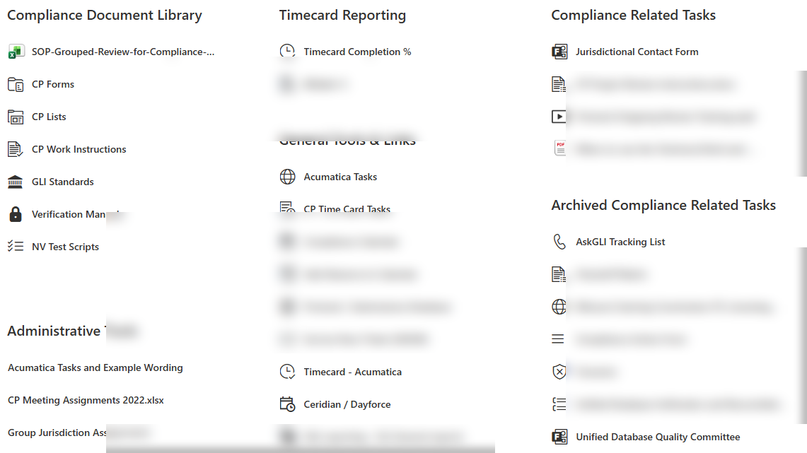
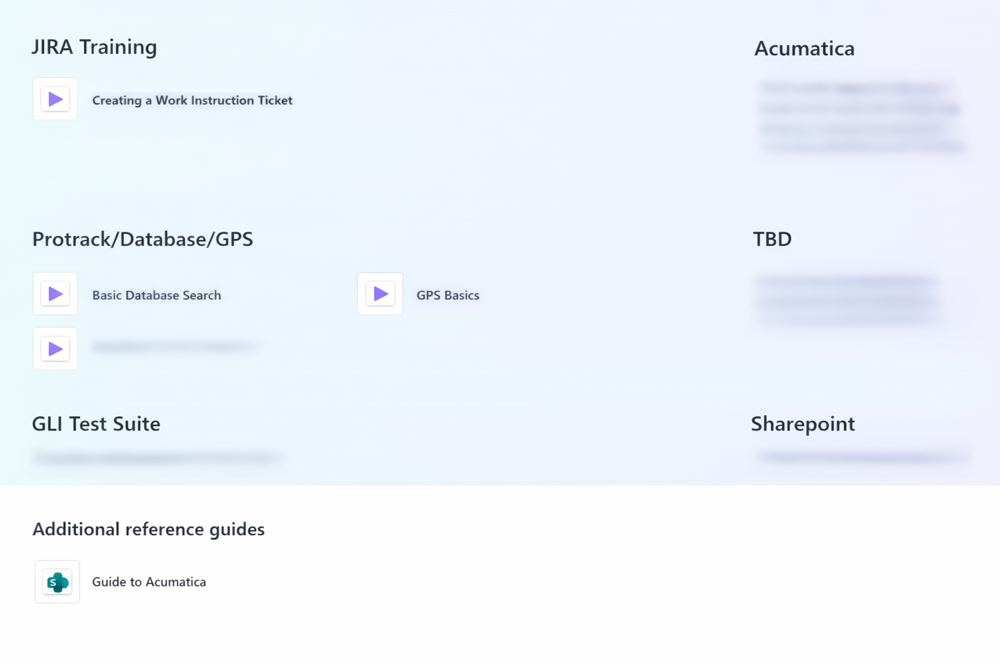
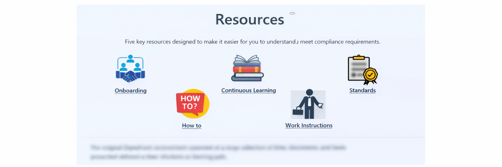
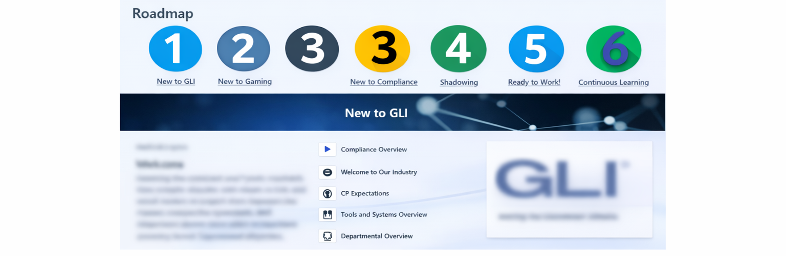
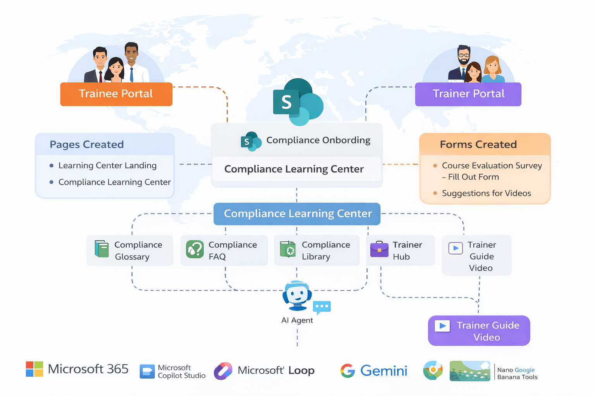

# Global-Training-Compliance-Platform-SharePoint-
Designed and deployed a global training and compliance platform used across 30+ countries, transforming a fragmented, manual process into a scalable and structured digital system.

💡 Solution
Architected and implemented a scalable SharePoint-based training ecosystem to standardize and modernize learning across the organization.
Key Features

Dedicated trainee and trainer portals
Structured learning paths with estimated completion times
Step-by-step How‑To guides and Work Instructions
Video-based training modules for asynchronous learning
Multi-level page architecture for intuitive navigation
AI-powered companion agent to assist users during training

📸 Screenshots

Screenshots are sanitized to remove proprietary, sensitive, or identifying information.
Visuals are provided solely to demonstrate information architecture and UX design.

📉 Before: Fragmented and Unstructured System

Key Issues:

* Information overload due to dense and unorganized layout
* No guided training experience for new users
* Mixed content types (tools, documents, training) without categorization
* High dependency on manual guidance and tribal knowledge

This created inefficiencies in onboarding and made it difficult for users to navigate and find relevant resources.

📈 After: Centralized and Guided Training Hub

Key Improvements:

* Separation of training, tools, and reference documentation
* Improved discoverability through structured navigation and visual cues
* Improved onboarding clarity and consistency
* Faster access to training and compliance resources
* Reduced time spent searching for documentation
* Scalable foundation for future automation and AI assistance

The redesigned SharePoint training hub provides a single source of truth for
new hires and existing employees, enabling a consistent, self-service learning
experience and significantly improving onboarding efficiency.

🧭 Mini Architecture / Site Map
The SharePoint Training Hub was designed as a centralized entry point that guides users through onboarding, role-specific learning, and ongoing compliance education using a clear, scalable information architecture.

🛠️ Tools & Technologies
Platform & Core System

SharePoint Online (Microsoft 365) — portal development and content management

AI & Automation

Microsoft Copilot Studio — AI-powered training assistant and system guidance
AI-assisted media tools — enhancement of training visuals and videos

Planning & Collaboration

Microsoft Loop — planning, documentation, and workflow organization

System Design

Information architecture and content structuring
UX/UI design for internal enterprise platforms

⚙️ System Design Highlights

Scalable content architecture suitable for global use
Asynchronous, self-paced learning across regions
Reduced dependency on trainers through AI-assisted support
Standardized training experience across teams and jurisdictions

🌍 Impact

Enabled consistent training across 30+ countries
Transformed a fragmented, manual process into a structured digital system
Improved onboarding efficiency and knowledge accessibility
Increased scalability of compliance training operations

🧠 Skills Demonstrated

Enterprise System Design
Information Architecture
Process Optimization
Knowledge Management Systems
AI Integration in Business Workflows

🚀 Future Enhancements
Planned and proposed enhancements to further evolve the platform:
Content & Learning Enhancements

Refresher training courses and periodic knowledge checks
Short quizzes to reinforce learning and validate understanding
Integration of LinkedIn Learning paths into Continuous Learning
Video-based welcome experience on the main landing page
Expanded use of multimedia (audio/video) in How‑To and Work Instructions

Platform & Page Enhancements

Main page updates aligned with evolving compliance priorities
Enhanced “Meet the Team” page to improve engagement and visibility
Dedicated news and updates section within the Compliance page

AI & Automation Enhancements

Deployment of an AI system picker agent to guide users to the correct tools and resources
AI-assisted generation of compliance news and updates
Expanded Copilot agent capabilities to support contextual learning and navigation

These enhancements are designed to improve engagement, reinforce learning, and further reduce manual dependency while remaining aligned with enterprise governance.

📄 Disclaimer
This repository documents a sanitized, public-facing reference implementation inspired by a real-world enterprise SharePoint solution.
All screenshots, diagrams, and descriptions have been modified to remove proprietary, sensitive, or identifying information. This project is shared solely to demonstrate design, architecture, and documentation practices.

